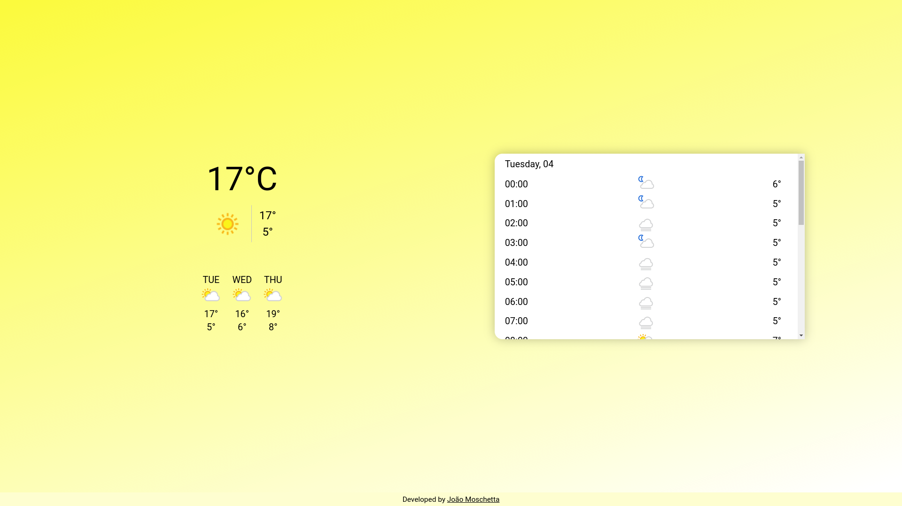
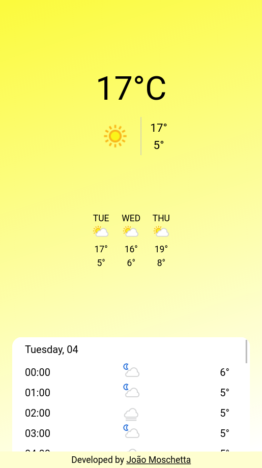

<h1 align="center">Weather App</h1>

<div align="center">
  
  
</div>

**[Live Demo](https://weather-app-joaomoschetta.herokuapp.com/)**

[Figma (layout link)](https://www.figma.com/proto/5usL5CIGCmWA8nvNslOWu9/Weather-app?node-id=1%3A2&scaling=min-zoom)

<br>

## ❓ About

React weather app was built to improve practical knowledge about the used technologies. Main features of the project:
- Current weather
- Next 3 days general weather
- 24 hours weather of the current day

This project was built using [create-react-app](https://create-react-app.dev/).

<br>

## 💻 Tech

- [React.js](https://reactjs.org/)
- [Typescript](https://www.typescriptlang.org/)
- Testing with [Jest](https://jestjs.io/) and [react-testing-library](https://testing-library.com/docs/react-testing-library/intro/)
- [Axios](https://github.com/axios/axios)
- [Saas](https://github.com/sass/node-sass)

The app consume [weatherapi](https://www.weatherapi.com/). Have unit tests for components and it was built using [TDD](https://pt.wikipedia.org/wiki/Test-driven_development).

<br>

## ⚙️ Run Project

### Environment variables

Create **.env.local** on root of project and insert this variable:
```
REACT_APP_WEATHER_API_KEY="insert your key"
```
You can get you key in [weatherapi.com](https://www.weatherapi.com/docs/).

### Start project locally
```
yarn start
```

Runs the app in development mode.<br>
Open http://localhost:3000 to view it in the browser.

### Test project
```
yarn test
```